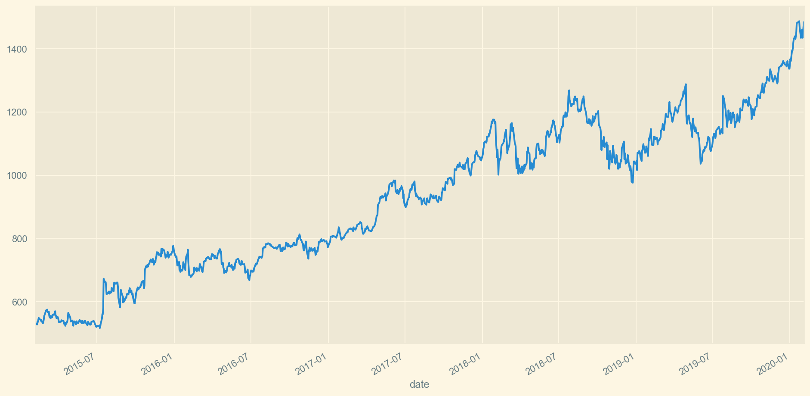
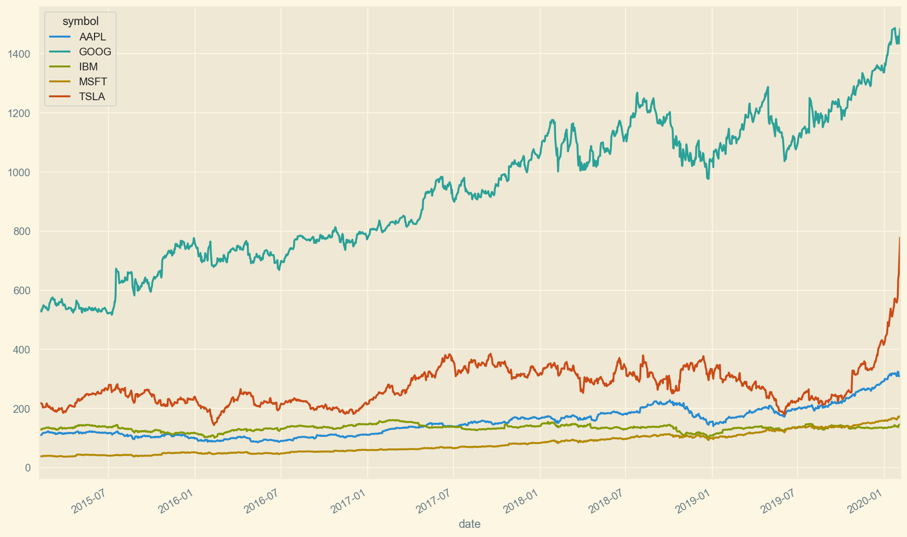
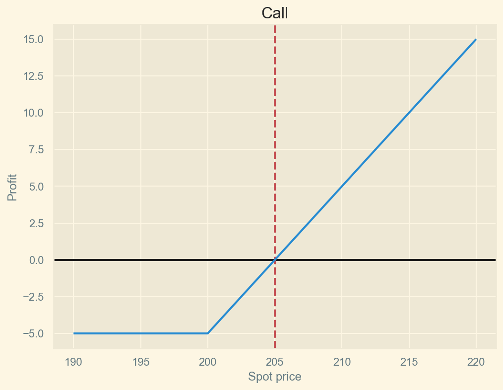
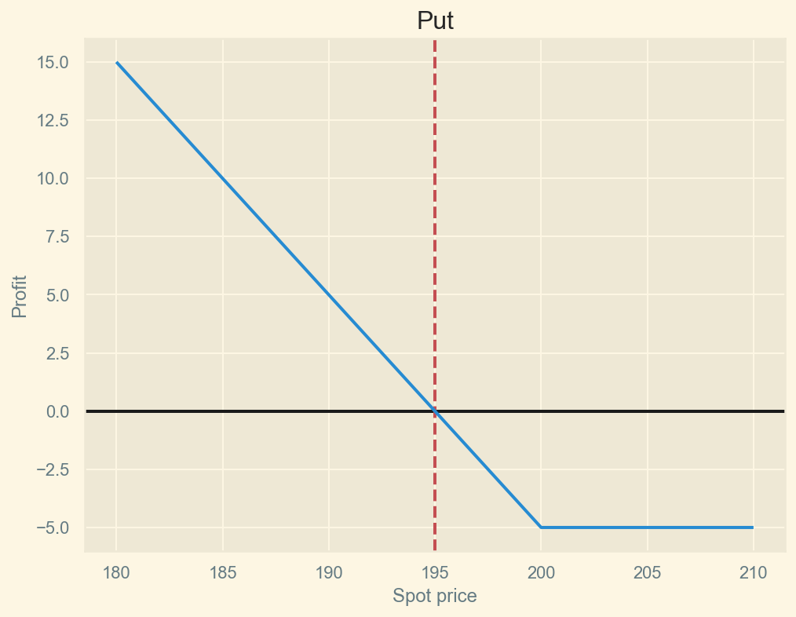
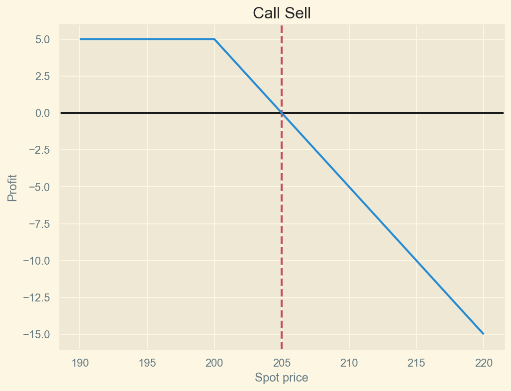
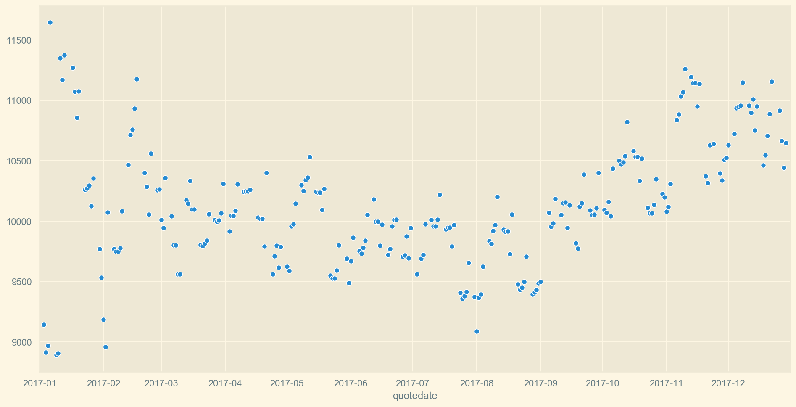
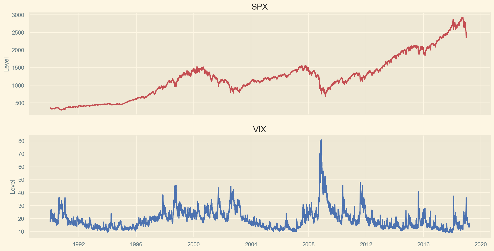
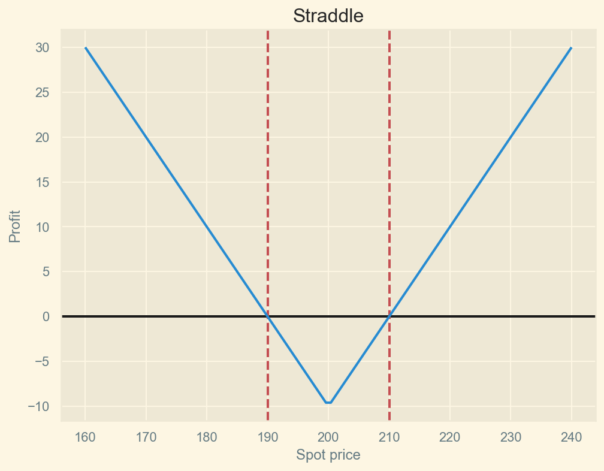
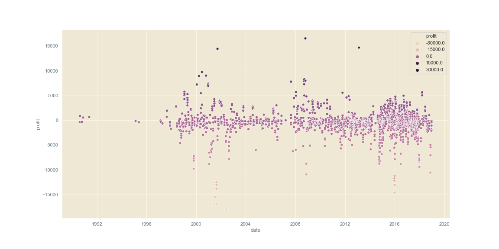
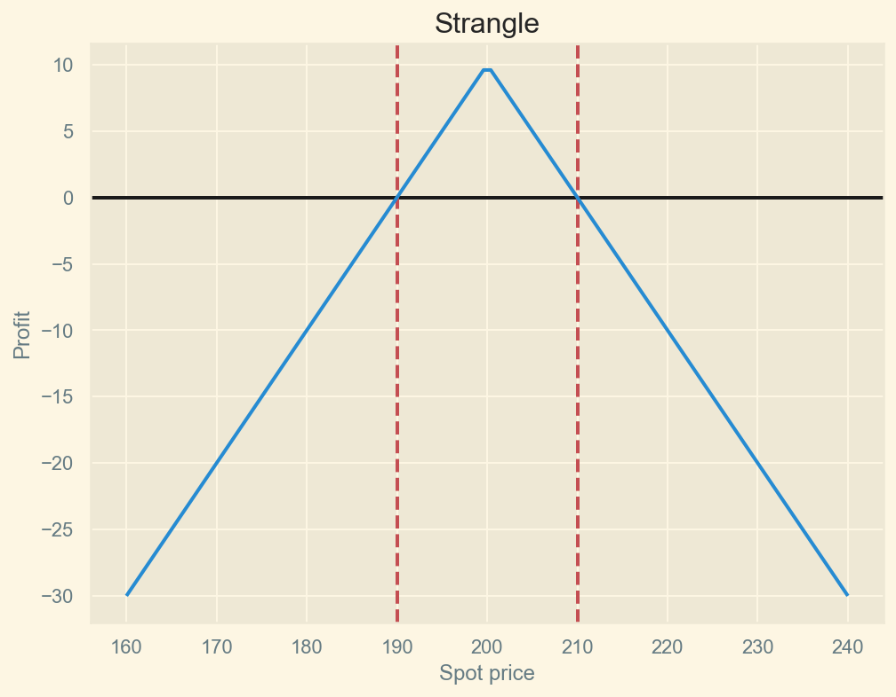

# Intro Finance

___

## 1. Stocks

From [Investopedia](https://www.investopedia.com/terms/s/stock.asp)
- A stock is a form of security that indicates the holder has proportionate ownership in the issuing corporation.
- Corporations issue (sell) stock to raise funds to operate their businesses. There are two main types of stock: common and preferred.
- Stocks are bought and sold predominantly on stock exchanges, though there can be private sales as well, and they are the foundation of nearly every portfolio.
- Historically, they have outperformed most other investments over the long run.
- Stocks are quoted on exchanges. The current market price is referred to as the **spot price** of the stock.
- A good primer on finance and the stock market is Malkiel's _A Random Walk Down Wall Street_.

<table class="tg" >
  <tr>
    <th class="tg-6uqc">Date</th>
    <th class="tg-6uqc">Close</th>
    <th class="tg-6uqc">High</th>
    <th class="tg-6uqc">Low</th>
    <th class="tg-6uqc">Open</th>
    <th class="tg-6uqc">volume</th>
    <th class="tg-6uqc">adjClose</th>
    <th class="tg-6uqc">adjHigh</th>
    <th class="tg-6uqc">adjLow</th>
    <th class="tg-6uqc">adjOpen</th>
    <th class="tg-6uqc">adjVolume</th>
    <th class="tg-6uqc">divCash</th>
    <th class="tg-6uqc">splitFactor</th>
  </tr>
  <tr>
    <td class="tg-6uqc">2020-01-23 </td>
    <td class="tg-xp2k">1486.65</td>
    <td class="tg-xp2k">1495.52</td>
    <td class="tg-xp2k">1482.1</td>
    <td class="tg-xp2k">1487.64</td>
    <td class="tg-xp2k">1351354</td>
    <td class="tg-xp2k">1486.65</td>
    <td class="tg-xp2k">1495.52</td>
    <td class="tg-xp2k">1482.1</td>
    <td class="tg-xp2k">1487.64</td>
    <td class="tg-xp2k">1351354</td>
    <td class="tg-xp2k">0.0</td>
    <td class="tg-xp2k">1.0</td>
  </tr>
  <tr>
    <td class="tg-6uqc">2020-01-22 </td>
    <td class="tg-xp2k">1485.95</td>
    <td class="tg-xp2k">1503.21</td>
    <td class="tg-xp2k">1484.93</td>
    <td class="tg-xp2k">1491.0</td>
    <td class="tg-xp2k">1610846</td>
    <td class="tg-xp2k">1485.95</td>
    <td class="tg-xp2k">1503.21</td>
    <td class="tg-xp2k">1484.93</td>
    <td class="tg-xp2k">1491.0</td>
    <td class="tg-xp2k">1610846</td>
    <td class="tg-xp2k">0.0</td>
    <td class="tg-xp2k">1.0</td>
  </tr>
  <tr>
    <td class="tg-6uqc">2020-01-21 </td>
    <td class="tg-xp2k">1484.4</td>
    <td class="tg-xp2k">1491.85</td>
    <td class="tg-xp2k">1471.2</td>
    <td class="tg-xp2k">1479.12</td>
    <td class="tg-xp2k">2008830</td>
    <td class="tg-xp2k">1484.4</td>
    <td class="tg-xp2k">1491.85</td>
    <td class="tg-xp2k">1471.2</td>
    <td class="tg-xp2k">1479.12</td>
    <td class="tg-xp2k">2008830</td>
    <td class="tg-xp2k">0.0</td>
    <td class="tg-xp2k">1.0</td>
  </tr>
  <tr>
    <td class="tg-6uqc">2020-01-17 </td>
    <td class="tg-xp2k">1480.39</td>
    <td class="tg-xp2k">1481.3</td>
    <td class="tg-xp2k">1458.22</td>
    <td class="tg-xp2k">1462.91</td>
    <td class="tg-xp2k">2396215</td>
    <td class="tg-xp2k">1480.39</td>
    <td class="tg-xp2k">1481.3</td>
    <td class="tg-xp2k">1458.22</td>
    <td class="tg-xp2k">1462.91</td>
    <td class="tg-xp2k">2396215</td>
    <td class="tg-xp2k">0.0</td>
    <td class="tg-xp2k">1.0</td>
  </tr>
  <tr>
    <td class="tg-6uqc">2020-01-16 </td>
    <td class="tg-xp2k">1451.7</td>
    <td class="tg-xp2k">1451.99</td>
    <td class="tg-xp2k">1440.92</td>
    <td class="tg-xp2k">1447.44</td>
    <td class="tg-xp2k">1173688</td>
    <td class="tg-xp2k">1451.7</td>
    <td class="tg-xp2k">1451.99</td>
    <td class="tg-xp2k">1440.92</td>
    <td class="tg-xp2k">1447.44</td>
    <td class="tg-xp2k">1173688</td>
    <td class="tg-xp2k">0.0</td>
    <td class="tg-xp2k">1.0</td>
  </tr>
  <tr>
    <td class="tg-6uqc">2020-01-15 </td>
    <td class="tg-xp2k">1439.2</td>
    <td class="tg-xp2k">1441.39</td>
    <td class="tg-xp2k">1430.21</td>
    <td class="tg-xp2k">1430.21</td>
    <td class="tg-xp2k">1282685</td>
    <td class="tg-xp2k">1439.2</td>
    <td class="tg-xp2k">1441.39</td>
    <td class="tg-xp2k">1430.21</td>
    <td class="tg-xp2k">1430.21</td>
    <td class="tg-xp2k">1282685</td>
    <td class="tg-xp2k">0.0</td>
    <td class="tg-xp2k">1.0</td>
  </tr>
  <tr>
    <td class="tg-6uqc">2020-01-14 </td>
    <td class="tg-xp2k">1430.88</td>
    <td class="tg-xp2k">1441.8</td>
    <td class="tg-xp2k">1428.37</td>
    <td class="tg-xp2k">1439.01</td>
    <td class="tg-xp2k">1560453</td>
    <td class="tg-xp2k">1430.88</td>
    <td class="tg-xp2k">1441.8</td>
    <td class="tg-xp2k">1428.37</td>
    <td class="tg-xp2k">1439.01</td>
    <td class="tg-xp2k">1560453</td>
    <td class="tg-xp2k">0.0</td>
    <td class="tg-xp2k">1.0</td>
  </tr>
  <tr>
    <td class="tg-6uqc">2020-01-13</td>
    <td class="tg-xp2k">1439.23</td>
    <td class="tg-xp2k">1440.52</td>
    <td class="tg-xp2k">1426.02</td>
    <td class="tg-xp2k">1436.13</td>
    <td class="tg-xp2k">1378286</td>
    <td class="tg-xp2k">1439.23</td>
    <td class="tg-xp2k">1440.52</td>
    <td class="tg-xp2k">1426.02</td>
    <td class="tg-xp2k">1436.13</td>
    <td class="tg-xp2k">1378286</td>
    <td class="tg-xp2k">0.0</td>
    <td class="tg-xp2k">1.0</td>
  </tr>
  <tr>
    <td class="tg-6uqc">2020-01-10 </td>
    <td class="tg-xp2k">1429.73</td>
    <td class="tg-xp2k">1434.93</td>
    <td class="tg-xp2k">1418.35</td>
    <td class="tg-xp2k">1427.56</td>
    <td class="tg-xp2k">1821566</td>
    <td class="tg-xp2k">1429.73</td>
    <td class="tg-xp2k">1434.93</td>
    <td class="tg-xp2k">1418.35</td>
    <td class="tg-xp2k">1427.56</td>
    <td class="tg-xp2k">1821566</td>
    <td class="tg-xp2k">0.0</td>
    <td class="tg-xp2k">1.0</td>
  </tr>
</table>

- `close` is the end-of-day (EOD) price
- `open` is the first price for the day
- `volume` is the number of stocks traded
- `adj*` columns are adjusted prices for stock splits/dividend disbursements

<table class="tg" style="margin-left:150px;">
  <tr>
    <th class="tg-y8gt">Date</th>
    <th class="tg-y8gt">AAPL</th>
    <th class="tg-y8gt">GOOG</th>
    <th class="tg-y8gt">IBM</th>
    <th class="tg-y8gt">MSFT</th>
    <th class="tg-y8gt">TSLA</th>
  </tr>
  <tr>
    <td class="tg-y8gt">2020-01-16</td>
    <td class="tg-ng9p">315.24</td>
    <td class="tg-ng9p">1451.7</td>
    <td class="tg-ng9p">137.98</td>
    <td class="tg-ng9p">166.17</td>
    <td class="tg-ng9p">513.49</td>
  </tr>
  <tr>
    <td class="tg-y8gt">2020-01-17</td>
    <td class="tg-ng9p">318.73</td>
    <td class="tg-ng9p">1480.39</td>
    <td class="tg-ng9p">138.31</td>
    <td class="tg-ng9p">167.1</td>
    <td class="tg-ng9p">510.5</td>
  </tr>
  <tr>
    <td class="tg-y8gt">2020-01-21</td>
    <td class="tg-ng9p">316.57</td>
    <td class="tg-ng9p">1484.4</td>
    <td class="tg-ng9p">139.17</td>
    <td class="tg-ng9p">166.5</td>
    <td class="tg-ng9p">547.2</td>
  </tr>
  <tr>
    <td class="tg-y8gt">2020-01-22</td>
    <td class="tg-ng9p">317.7</td>
    <td class="tg-ng9p">1485.95</td>
    <td class="tg-ng9p">143.89</td>
    <td class="tg-ng9p">165.7</td>
    <td class="tg-ng9p">569.56</td>
  </tr>
  <tr>
    <td class="tg-y8gt">2020-01-23</td>
    <td class="tg-ng9p">319.23</td>
    <td class="tg-ng9p">1486.65</td>
    <td class="tg-ng9p">142.87</td>
    <td class="tg-ng9p">166.72</td>
    <td class="tg-ng9p">572.2</td>
  </tr>
</table>

### Key concepts

- _Return_
 
$$R(S, t, t_0) = \dfrac{S_t - S_0}{S_0} = \dfrac{S_t}{S_0} - 1$$

- _Volatility_
 
$$\sigma = \sqrt{\frac{\sum\limits_{i=0}^t (S_i -\mu)^2}{t}}$$
 
Where stock $S_t$ is the price of the stock at time $t$ and $\mu$ is the mean return.

<table class="tg" style="margin-left:250px;">
  <tr>
    <th class="tg-y8gt"></th>
    <th class="tg-y8gt">Std </th>
  </tr>
  <tr>
    <td class="tg-y8gt">AAPL</td>
    <td class="tg-iamc">48.92</td>
  </tr>
  <tr>
    <td class="tg-y8gt">GOOG</td>
    <td class="tg-iamc">233.32</td>
  </tr>
  <tr>
    <td class="tg-y8gt">IBM</td>
    <td class="tg-iamc">10.55</td>
  </tr>
  <tr>
    <td class="tg-y8gt">MSFT</td>
    <td class="tg-iamc">34.19</td>
  </tr>
  <tr>
    <td class="tg-y8gt">TSLA</td>
    <td class="tg-iamc">61.32</td>
  </tr>
</table>

Lets look at the daily returns for each symbol.

<table class="tg" style="margin-left:150px;">
  <tr>
    <th class="tg-6uqc">Date</th>
    <th class="tg-6uqc">AAPL</th>
    <th class="tg-6uqc">GOOG</th>
    <th class="tg-6uqc">IBM</th>
    <th class="tg-6uqc">MSFT</th>
    <th class="tg-6uqc">TSLA</th>
  </tr>
  <tr>
    <td class="tg-6uqc">2020-01-16</td>
    <td class="tg-664r">0.0125</td>
    <td class="tg-664r">0.0087</td>
    <td class="tg-664r">0.0099</td>
    <td class="tg-664r">0.0183</td>
    <td class="tg-664r">-0.0097</td>
  </tr>
  <tr>
    <td class="tg-6uqc">2020-01-17</td>
    <td class="tg-664r">0.0111</td>
    <td class="tg-664r">0.0198</td>
    <td class="tg-664r">0.0024</td>
    <td class="tg-664r">0.0056</td>
    <td class="tg-664r">-0.0058</td>
  </tr>
  <tr>
    <td class="tg-6uqc">2020-01-21</td>
    <td class="tg-664r">-0.0068</td>
    <td class="tg-664r">0.0027</td>
    <td class="tg-664r">0.0062</td>
    <td class="tg-664r">-0.0036</td>
    <td class="tg-664r">0.0719</td>
  </tr>
  <tr>
    <td class="tg-6uqc">2020-01-22</td>
    <td class="tg-664r">0.0036</td>
    <td class="tg-664r">0.0010</td>
    <td class="tg-664r">0.0339</td>
    <td class="tg-664r">-0.0048</td>
    <td class="tg-664r">0.0409</td>
  </tr>
  <tr>
    <td class="tg-6uqc">2020-01-23</td>
    <td class="tg-664r">0.0048</td>
    <td class="tg-664r">0.0005</td>
    <td class="tg-664r">-0.0071</td>
    <td class="tg-664r">0.0062</td>
    <td class="tg-664r">0.0046</td>
  </tr>
</table>

<table class="tg" style=" margin-left:250px;">
  <tr>
    <th class="tg-y8gt"></th>
    <th class="tg-y8gt">Std</th>
  </tr>
  <tr>
    <td class="tg-y8gt">AAPL</td>
    <td class="tg-ng9p">0.0156</td>
  </tr>
  <tr>
    <td class="tg-y8gt">GOOG</td>
    <td class="tg-ng9p">0.0151</td>
  </tr>
  <tr>
    <td class="tg-y8gt">IBM</td>
    <td class="tg-ng9p">0.0129</td>
  </tr>
  <tr>
    <td class="tg-y8gt">MSFT</td>
    <td class="tg-ng9p">0.0147</td>
  </tr>
  <tr>
    <td class="tg-y8gt">TSLA</td>
    <td class="tg-ng9p">0.0285</td>
  </tr>
</table>

## Indeces and ETFs

### Index
- An [index](https://www.investopedia.com/terms/i/index.asp) consists of a hypothetical portfolio of securities representing a particular market or a segment of it.
- Common examples: S&P500, FTSE100, Russell 2000, US Aggregate Bond Index.
- S&P500 is a commonly used benchmark for the stock market. It aggregates 500 of the largest US publicly traded companies weighted by market cap. It includes 75% of the total stocks traded in the US.

### ETF
- An [exchange traded fund](https://www.investopedia.com/terms/e/etf.asp) is is a marketable security that tracks a stock index, a commodity, bonds, or a basket of assets.
- Benefits: Low fees, lower taxes.
- They allow investors to trade a portfolio of stocks with lower capital margin.
- Common examples: SPDR (_Spider_, tracks S&P500), VOO (Vanguard S&P500 Index Fund), iShares Russell 2000, BLV (Vanguard Long-Term Bond)

## 2. Options

From [Investopedia](https://www.investopedia.com/terms/o/option.asp)

- Options are financial derivatives that give buyers the right, but not obligation, to buy or sell an underlying asset at an agreed upon price during a certain period of time.
- Two exercise types: _European_ (may exercise **at** expiration) and _American_ (may exercise at any moment **prior** to expiration)
- Basic options come in two types: _Calls_ and _Puts_
- Calls and puts form the basis for a wide range of option strategies designed for hedging, protection and speculation.
- They are also used as a leveraging tool. Option contracts represent (in general) 100 shares of the underlying stock while costing only a fraction of the price.
- For more information on options, a good source is Natenberg's _Option Volatility and Pricing_. Also, Hull's _Options, Futures, and Other Derivatives_ is a comprehensive textbook on the subject of financial derivatives.

Option contracts specify the following parts:

$S$ - Underlying asset  
$K$ - Strike price  
$\text{Expiration}$ - Days to expiration (dte)  
$\text{Price}$ - Price of the option, also called **premium**

### Key concepts

- **OTM**, Out of the money : $K < S_t$ for puts, $K > S_t$ for calls
- **ATM**, At the money : When $K \approx S_t$
- **ITM**, In the money : $K > S_t$ for puts, $K < S_t$ for calls
- Cash-settled options are payed in cash, no physical delivery of the underlying asset takes place. The amount payed is the difference between the strike price of the option and the value of the asset at exercise date.

### Calls

- Give the bearer the right to _buy_ the underlying asset at a given date for an agreed upon price.
- Can be thought of as an insurance against _asset price increases_.
 
 
$$\text{Payoff} \equiv max(S_t - K, 0)$$
 
$$\text{Profit} \equiv max(S_t - K, 0) - C(K, t, t_0)$$
 
Where $S_t$ is the price of the asset at the day of expiration $t$ and $C(K, t, t_0)$ is the premium payed for the call purchased at time $t_0$ with strike price $K$.

### Puts
- Give the bearer the right to _sell_ the underlying asset at a given date for an agreed upon price.
- Can be thought of as an insurance against _asset price decreases_.
 
 
$$\text{Payoff} \equiv max(K - S_t, 0)$$
 
$$\text{Profit} \equiv max(K - S_t, 0) - P(K, t, t_0)$$
 
Where $S_t$ is the price of the asset at the day of expiration $t$ and $P(K, t, t_0)$ is the premium payed for the put purchased at time $t_0$ with strike price $K$.

## Selling options

- A trader can choose to sell options, also referred as **writing** options.
- Investor earns the option premium and must settle at expiration date or cover the position by buying the contract.

### Selling calls

- Also known as _naked call selling_
- Exposed to price increases of the underlying. Unlimited risk.
 
 
$$\text{Profit} \equiv C(K, t, t_0) - max(S_t - K, 0)$$

### Selling puts

- Less risky than selling calls.
- Exposed to price decreases of the underlying.
- Max loss capped at $K - P$.
 
 
$$\text{Profit} \equiv P(K, t, t_0) - max(K - S_t, 0)$$

<table class="tg">
  <tr>
    <th class="tg-ttiq"></th>
    <th class="tg-ttiq">underlying</th>
    <th class="tg-ttiq">underlying_last</th>
    <th class="tg-ttiq">optionroot</th>
    <th class="tg-ttiq">type</th>
    <th class="tg-ttiq">expiration</th>
    <th class="tg-ttiq">quotedate</th>
    <th class="tg-ttiq">strike</th>
    <th class="tg-ttiq">last</th>
    <th class="tg-ttiq">bid</th>
    <th class="tg-ttiq">ask</th>
    <th class="tg-ttiq">openinterest</th>
    <th class="tg-ttiq">impliedvol</th>
    <th class="tg-ttiq">delta</th>
    <th class="tg-ttiq">gamma</th>
    <th class="tg-ttiq">theta</th>
    <th class="tg-ttiq">vega</th>
  </tr>
  <tr>
    <td class="tg-ttiq">13328880</td>
    <td class="tg-ng9p">SPX</td>
    <td class="tg-ng9p">2257.83</td>
    <td class="tg-ng9p">SPX170120C00100000</td>
    <td class="tg-ng9p">call</td>
    <td class="tg-ng9p">2017-01-20</td>
    <td class="tg-ng9p">2017-01-03</td>
    <td class="tg-ng9p">100.0</td>
    <td class="tg-ng9p">2161.5</td>
    <td class="tg-ng9p">2154.3</td>
    <td class="tg-ng9p">2158.7</td>
    <td class="tg-ng9p">5615</td>
    <td class="tg-ng9p">0.1214</td>
    <td class="tg-ng9p">1.0</td>
    <td class="tg-ng9p">0.0</td>
    <td class="tg-ng9p">-1.0239</td>
    <td class="tg-ng9p">0.0</td>
  </tr>
  <tr>
    <td class="tg-ttiq">13328881</td>
    <td class="tg-ng9p">SPX</td>
    <td class="tg-ng9p">2257.83</td>
    <td class="tg-ng9p">SPX170120C00200000</td>
    <td class="tg-ng9p">call</td>
    <td class="tg-ng9p">2017-01-20</td>
    <td class="tg-ng9p">2017-01-03</td>
    <td class="tg-ng9p">200.0</td>
    <td class="tg-ng9p">2060.95</td>
    <td class="tg-ng9p">2054.4</td>
    <td class="tg-ng9p">2058.8</td>
    <td class="tg-ng9p">6355</td>
    <td class="tg-ng9p">0.1214</td>
    <td class="tg-ng9p">1.0</td>
    <td class="tg-ng9p">0.0</td>
    <td class="tg-ng9p">-2.0479</td>
    <td class="tg-ng9p">0.0</td>
  </tr>
  <tr>
    <td class="tg-ttiq">13328882</td>
    <td class="tg-ng9p">SPX</td>
    <td class="tg-ng9p">2257.83</td>
    <td class="tg-ng9p">SPX170120C00300000</td>
    <td class="tg-ng9p">call</td>
    <td class="tg-ng9p">2017-01-20</td>
    <td class="tg-ng9p">2017-01-03</td>
    <td class="tg-ng9p">300.0</td>
    <td class="tg-ng9p">1960.45</td>
    <td class="tg-ng9p">1954.4</td>
    <td class="tg-ng9p">1958.8</td>
    <td class="tg-ng9p">2000</td>
    <td class="tg-ng9p">0.1214</td>
    <td class="tg-ng9p">1.0</td>
    <td class="tg-ng9p">0.0</td>
    <td class="tg-ng9p">-3.0718</td>
    <td class="tg-ng9p">0.0</td>
  </tr>
  <tr>
    <td class="tg-ttiq">13328883</td>
    <td class="tg-ng9p">SPX</td>
    <td class="tg-ng9p">2257.83</td>
    <td class="tg-ng9p">SPX170120C00400000</td>
    <td class="tg-ng9p">call</td>
    <td class="tg-ng9p">2017-01-20</td>
    <td class="tg-ng9p">2017-01-03</td>
    <td class="tg-ng9p">400.0</td>
    <td class="tg-ng9p">1760.55</td>
    <td class="tg-ng9p">1854.6</td>
    <td class="tg-ng9p">1858.9</td>
    <td class="tg-ng9p">25</td>
    <td class="tg-ng9p">0.1214</td>
    <td class="tg-ng9p">1.0</td>
    <td class="tg-ng9p">0.0</td>
    <td class="tg-ng9p">-4.0957</td>
    <td class="tg-ng9p">0.0</td>
  </tr>
  <tr>
    <td class="tg-ttiq">13328884</td>
    <td class="tg-ng9p">SPX</td>
    <td class="tg-ng9p">2257.83</td>
    <td class="tg-ng9p">SPX170120C00500000</td>
    <td class="tg-ng9p">call</td>
    <td class="tg-ng9p">2017-01-20</td>
    <td class="tg-ng9p">2017-01-03</td>
    <td class="tg-ng9p">500.0</td>
    <td class="tg-ng9p">1749.33</td>
    <td class="tg-ng9p">1754.6</td>
    <td class="tg-ng9p">1758.9</td>
    <td class="tg-ng9p">3813</td>
    <td class="tg-ng9p">0.1214</td>
    <td class="tg-ng9p">1.0</td>
    <td class="tg-ng9p">0.0</td>
    <td class="tg-ng9p">-5.1197</td>
    <td class="tg-ng9p">0.0</td>
  </tr>
</table>

- `optionroot` is the name of the contract (think `id`)
- `underlying_last` is the last seen price for the underlying
- `type` either call or put
- `strike` is the strike price
- `bid` price offered by the market maker for the contract
- `ask` price wanted by the market maker for the contract
- `volume` the number of contracts traded that day
- `openinterest` the total number of contracts open since it started trading

## Options pricing

Options and financial derivatives in general are notoriously difficult to price.  
They are related to the volatility of the underlying; that is, options for _low volatility_ assets are _less expensive_ than their counterparts, all else being equal.
They also suffer time decay. As they approach expiration, OTM options tend to 0 and ATM and ITM options tend to $S_t$.

## VIX index

Market volatility is measured by the [CBOE VIX index](https://www.investopedia.com/articles/active-trading/070213/tracking-volatility-how-vix-calculated.asp).
It's a benchmark index designed specifically to track S&P 500 volatility.  
Calculates volatility by averaging the weighted prices of OTM puts and calls using options that expire in 16 and 44 days.

$$\text{VIX} = 100 * \sigma$$

<table class="tg" style="margin-left:250px;">
  <tr>
    <th class="tg-y8gt">Date </th>
    <th class="tg-y8gt">Price</th>
  </tr>
  <tr>
    <td class="tg-ng9p">1990-01-02</td>
    <td class="tg-lkkz">359.69</td>
  </tr>
  <tr>
    <td class="tg-ng9p">1990-01-03</td>
    <td class="tg-lkkz">358.76</td>
  </tr>
  <tr>
    <td class="tg-ng9p">1990-01-04</td>
    <td class="tg-lkkz">355.66</td>
  </tr>
  <tr>
    <td class="tg-ng9p">1990-01-05</td>
    <td class="tg-lkkz">352.20</td>
  </tr>
  <tr>
    <td class="tg-ng9p">1990-01-08</td>
    <td class="tg-lkkz">353.79</td>
  </tr>
</table>

## 3. Option combinations

- Options trading strategies involve buying and selling a combination of options.
- Common ones include: straddles, strangles, calendar spreads, butterflies, condors.
- An approachable introduction to the subject is Passarelli's _Trading Options Greeks_. For a more in depth treatment, see _Volatility trading_ by Sinclair.

### Straddle

- Buy $n$ calls and $n$ puts with the same expiration and strike price close to the underlying's spot price
- This strategy is direction indifferent, the trader expects movement in the underlying but is indifferent as to whether that movement is up or down.
- This is an example of being _long volatility_. The trader is _buying volatility_.
 
 
$$\text{Profit} \equiv max(K - S_t, S_t - K, 0) - P(K, t, t_0) - C(K, t, t_0)$$

In the following chart, we buy straddles on SPX using options with 60 dte (with a tolerance level of 10%) and exit the trade 2 days before expiration.

### Strangle

- The opposite of a straddle.
- Sell $n$ calls and $n$ puts with the same expiration and strike price close to the underlying's spot price
- The trader expects little or (ideally) no movement in the underlying.
- This strategy profits from the premiums, with price movements in the underlying cutting into the trader's profit.
- Since the trader is selling options, there is potential for severe loss. This can be mitigated by buying out calls or puts when certain loss level is reached.
- This is an example of being _short volatility_. The trader is _selling volatility_.
 
 
$$\text{Profit} \equiv P(K, t, t_0) + C(K, t, t_0) - max(K - S_t, S_t - K, 0)$$

